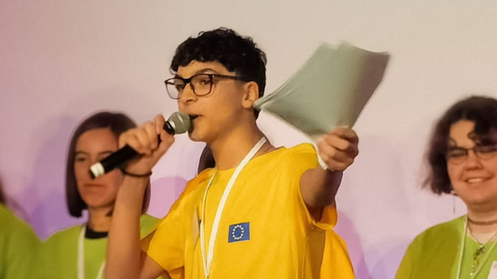

# 🚀 Gabriele Battimelli Portfolio

[](https://nextjs.org/) [](https://tailwindcss.com/) [](https://vercel.com/)

Welcome to my personal portfolio! This project showcases my work, skills, and projects using a modern tech stack and creative UI/UX.

---

## ✨ Features
- Interactive hero section & timeline
- Custom video player
- Responsive carousel
- Social links & contact info
- Fully responsive & mobile-friendly

---

## 🛠️ Tech Stack
- [Next.js](https://nextjs.org/)
- [React](https://react.dev/)
- [Tailwind CSS](https://tailwindcss.com/)
- [Three.js](https://threejs.org/) (for 3D models)
- [TypeScript](https://www.typescriptlang.org/)

---

## 🚦 Getting Started

Clone the repo and install dependencies:

```bash
git clone https://github.com/yourusername/gabriele-battimelli.git
cd gabriele-battimelli
npm install
```

Run the development server:

```bash
npm run dev
# or
yarn dev
# or
pnpm dev
# or
bun dev
```

Open [http://localhost:3000](http://localhost:3000) to see the result.

---

## 📸 Screenshots

| Hero Section | Timeline | Carousel |
|:---:|:---:|:---:|
|  |  |  |

---

## 📂 Project Structure
- `app/` - Main app components and pages
- `public/` - Static assets (images, videos, 3D models)
- `lib/` - Utility functions
- `types/` - TypeScript type definitions

---

## 🌐 Learn More
- [Next.js Documentation](https://nextjs.org/docs)
- [Learn Next.js](https://nextjs.org/learn)

---

## 🚀 Deploy
Deploy easily on [Vercel](https://vercel.com/new?utm_medium=default-template&filter=next.js&utm_source=create-next-app&utm_campaign=create-next-app-readme).

---

## 🙏 Credits
- [Geist Font](https://vercel.com/font)
- [Three.js](https://threejs.org/)

---

## 📬 Contact
Feel free to reach out via [LinkedIn](https://www.linkedin.com/in/gabrielebattimelli/) or open an issue!

---

> Made with ❤️ by Gabriele Battimelli
